# VitaVault

**VitaVault** is a full-stack personal health record platform built as a product-style healthcare workspace rather than a simple CRUD demo.

It combines structured health records, reminder and alert workflows, care-team collaboration, AI-assisted summaries, exports, security controls, admin tooling, device/mobile-ready foundations, and care workflow hubs inside one application.

The project is intentionally built like a business-grade product foundation: clean domain modeling, protected workflows, audit-aware actions, operational pages, public demo surfaces, and a roadmap-ready architecture for future healthcare, wellness, and care coordination features.

---

## Links

- **GitHub:** [shreyanshjain1/VitaVault](https://github.com/shreyanshjain1/VitaVault)
- **Vercel Demo:** [vita-vault-s6up.vercel.app](https://vita-vault-s6up.vercel.app/)
- **Public walkthrough:** open `/demo` or `/demo/walkthrough` on the deployed app
- **Feature matrix:** [`docs/FEATURE_MATRIX.md`](docs/FEATURE_MATRIX.md)
- **Demo note:** database-backed live flows depend on production environment configuration, so the no-login demo surface is the best way to review the product online.

---

## What VitaVault demonstrates

A lot of health-record portfolio apps stop at forms and a dashboard. VitaVault goes further by modeling the operational side of a real product.

The app demonstrates:

- longitudinal patient records across multiple clinical modules
- patient-controlled care-team sharing and invite flows
- alert rules, alert events, reminders, review queues, and audit history
- care workflow hubs for notifications, care planning, visit prep, medication safety, lab review, vitals monitoring, and symptom review
- queue-backed background processing with Redis and BullMQ
- device and mobile ingestion foundations
- AI-assisted summaries and insight workflows
- exports, print views, admin, ops, and security workflows
- public no-login demo experience for product showcasing

This repo sits at the intersection of **product engineering**, **health-data workflows**, and **production-minded full-stack architecture**.

---

## Product pillars

### Personal Health Record Workspace

Users can manage:

- health profile and baseline context
- medications, schedules, adherence logs, and medication safety review
- appointments, visit preparation, and care providers
- lab results with review readiness and trend context
- vital readings with monitoring and watch-zone signals
- symptom tracking with unresolved/severity review
- vaccinations and preventive care context
- medical documents with protected delivery and document-readiness signals
- reminders, summaries, exports, emergency card, and print-oriented views

### Shared Care Foundations

VitaVault includes collaboration-oriented flows such as:

- care-team invite creation and acceptance
- scoped shared access
- shared patient routes
- access-aware patient views
- invite email support and fallback link sharing
- caregiver workspace and access auditing foundations

### Alerts, Notifications, and Care Workflows

The platform includes health workflow primitives beyond storage:

- threshold-based alert rules
- alert events and lifecycle states
- notification center across alerts, reminders, appointments, labs, documents, invites, and devices
- care plan hub with readiness scoring and prioritized next actions
- visit prep hub for provider appointments and doctor packet handoff
- review queue pages and print-oriented review flows
- worker-backed scan and evaluation foundations

### Device and Mobile Readiness

The app is already structured for connected-data expansion:

- mobile login, logout, and session endpoints
- bearer-token foundations for mobile sync flows
- device connection tracking
- device reading ingestion
- sync job lifecycle tracking
- mirrored readings into normalized health records
- product-facing mobile/device API documentation

### AI, Trends, and Review Workflows

The intelligence layer is designed to sit on top of structured records:

- AI-generated health insights
- insight persistence model
- summary-generation foundations
- health trends analytics
- lab, vital, symptom, and medication review hubs
- patient summary and emergency card print surfaces

### Security, Admin, and Operations

The application includes stronger operational controls such as:

- Auth.js / NextAuth authentication
- protected user workflows
- password rotation
- email verification and password reset flows
- mobile/API session visibility and revocation foundations
- protected document delivery
- audit log viewer and security center
- admin, ops, jobs, and system readiness visibility pages

---

## Current application surface

### Authenticated product routes

| Area | Routes |
|---|---|
| Core | `/dashboard`, `/onboarding`, `/health-profile`, `/timeline` |
| Care workflow | `/notifications`, `/care-plan`, `/visit-prep`, `/emergency-card`, `/emergency-card/print` |
| Records | `/medications`, `/appointments`, `/doctors`, `/labs`, `/vitals`, `/symptoms`, `/vaccinations`, `/documents` |
| Review hubs | `/medication-safety`, `/lab-review`, `/vitals-monitor`, `/symptom-review`, `/trends` |
| Collaboration | `/care-team`, `/patient/[ownerUserId]`, `/invite/[token]` |
| Alerts & reminders | `/alerts`, `/alerts/[id]`, `/alerts/rules`, `/reminders`, `/review-queue`, `/review-queue/print` |
| Intelligence & reports | `/ai-insights`, `/summary`, `/summary/print`, `/exports` |
| Device/mobile | `/device-connection`, `/api-docs` |
| Security/admin/ops | `/audit-log`, `/security`, `/admin`, `/ops`, `/jobs` |
| Account access | `/login`, `/signup`, `/forgot-password`, `/reset-password`, `/verify-email` |

### Public demo routes

The app includes a no-login demo surface for product review and portfolio showcasing.

| Demo area | Routes |
|---|---|
| Demo shell | `/demo`, `/demo/walkthrough`, `/demo/dashboard` |
| Demo records | `/demo/health-profile`, `/demo/medications`, `/demo/appointments`, `/demo/doctors`, `/demo/labs`, `/demo/vitals`, `/demo/symptoms`, `/demo/vaccinations`, `/demo/documents` |
| Demo workflows | `/demo/care-team`, `/demo/ai-insights`, `/demo/alerts`, `/demo/timeline`, `/demo/reminders`, `/demo/review-queue`, `/demo/summary`, `/demo/exports` |
| Demo ops/security | `/demo/device-connection`, `/demo/jobs`, `/demo/ops`, `/demo/security`, `/demo/admin` |
| Authenticated feature hub previews | Linked from `/demo` and `/demo/walkthrough`: `/notifications`, `/care-plan`, `/trends`, `/medication-safety`, `/visit-prep`, `/lab-review`, `/vitals-monitor`, `/symptom-review`, `/emergency-card`, `/audit-log`, `/api-docs` |

---

## Feature matrix snapshot

| Product layer | Representative modules | What it shows |
|---|---|---|
| Patient record system | Profile, meds, appointments, doctors, labs, vitals, symptoms, vaccines, documents | Broad structured health data coverage |
| Care workflow layer | Notifications, care plan, visit prep, review queue, reminders, alerts | Next-action thinking beyond CRUD |
| Clinical review layer | Trends, medication safety, lab review, vitals monitor, symptom review | Data interpretation and follow-up readiness |
| Collaboration layer | Care team, shared patient workspace, invites | Patient-controlled care access |
| Reporting layer | Summary, summary print, emergency card, exports | Doctor handoff and portable records |
| Platform layer | Mobile/device APIs, jobs, ops, admin, audit log, security | Production-minded backend and operations |

See [`docs/FEATURE_MATRIX.md`](docs/FEATURE_MATRIX.md) for the full feature map.

---

## Architecture snapshot

| Layer | Implementation |
|---|---|
| App framework | Next.js 15 App Router |
| UI | React 19, TypeScript, Tailwind CSS, reusable component layer |
| Auth | Auth.js / NextAuth credentials flow |
| Data | Prisma ORM with PostgreSQL |
| Validation | Zod schemas and server-side validation helpers |
| Background jobs | Redis + BullMQ worker foundation |
| AI | OpenAI client integration foundation |
| Charts/UI utilities | Recharts, lucide-react, Framer Motion |
| Testing | Vitest with targeted route/business-logic coverage |
| Repo health | action export checks, import checks, hygiene checks, Prisma validation |

---

## Domain model coverage

The Prisma schema models a broad health-product domain, including:

- users, auth state, verification, password resets, and health profiles
- doctors and appointments
- medications, schedules, and adherence logs
- labs, vitals, symptoms, and vaccinations
- documents and protected file access
- care invites and care access
- reminders and exports
- AI insights
- mobile sessions
- device connections and device readings
- sync jobs
- alert rules, alert events, and alert audits
- job runs and job run logs

This gives the project enough depth to support future upgrades without constantly redesigning the database from scratch.

---

## Screenshots

### Core experience

| Dashboard | Health Profile |
|---|---|
|  |  |

| Medications | Appointments |
|---|---|
|  |  |

| Labs | Exports |
|---|---|
|  | 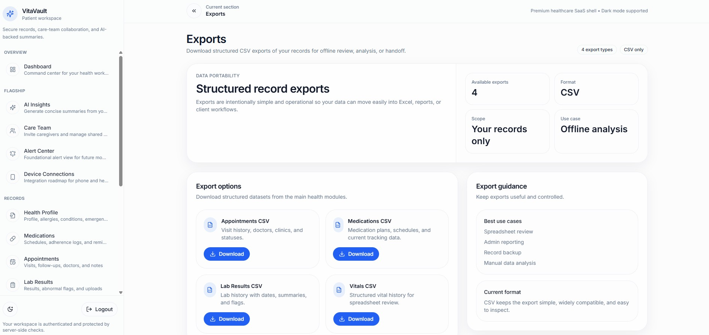 |

### Collaboration and intelligence

| AI Insights | Care Team |
|---|---|
| 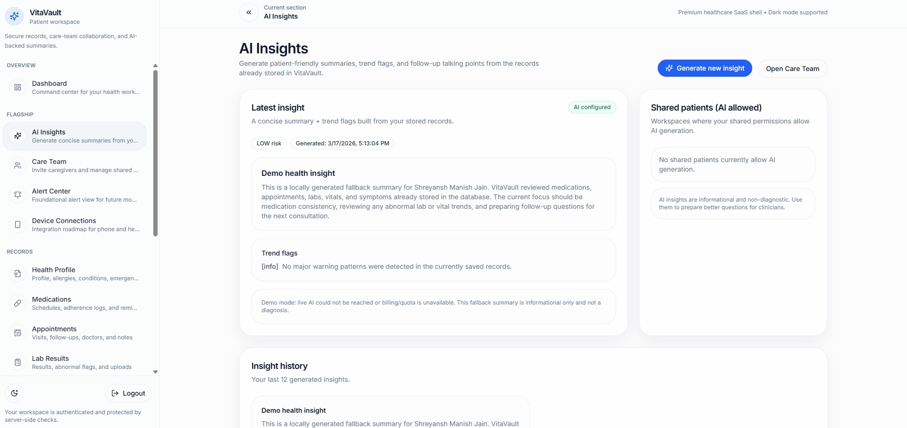 | 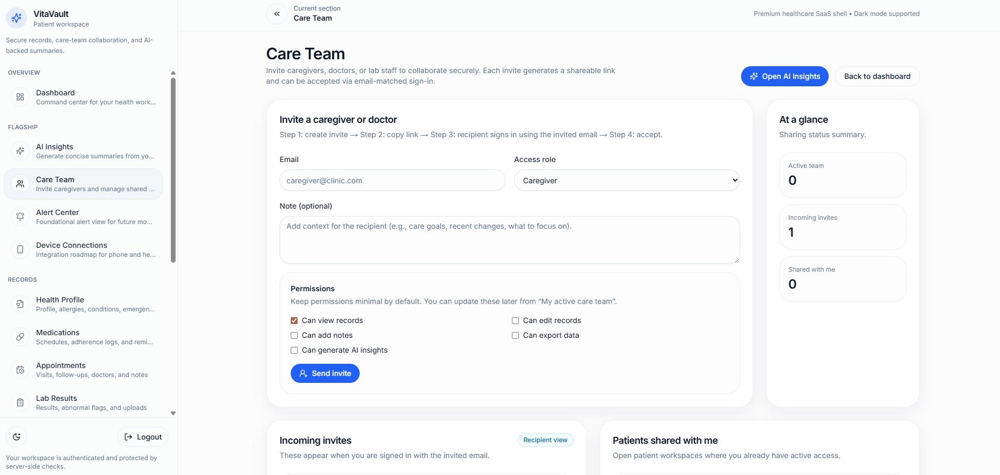 |

| Alert Center | Device Connection |
|---|---|
| 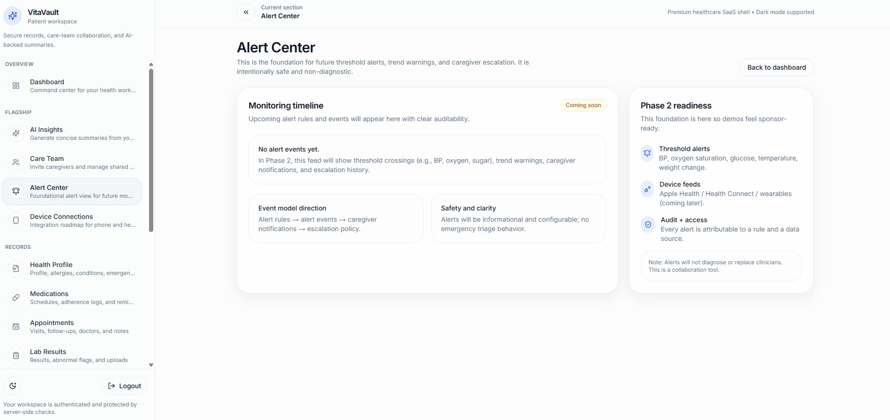 | 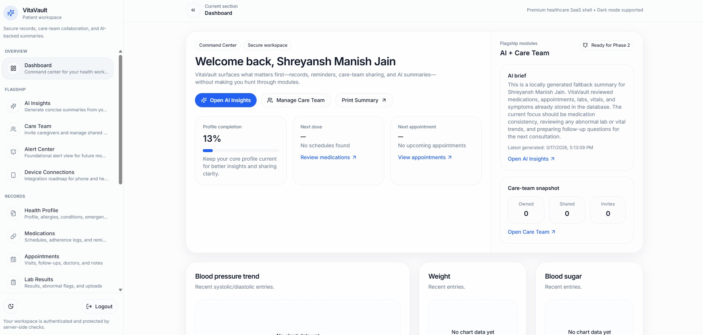 |

### Clinical records

| Vaccinations | Doctors |
|---|---|
| 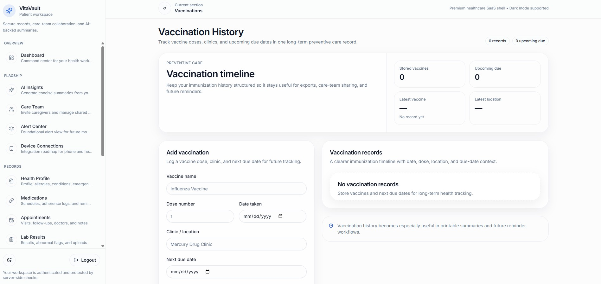 | 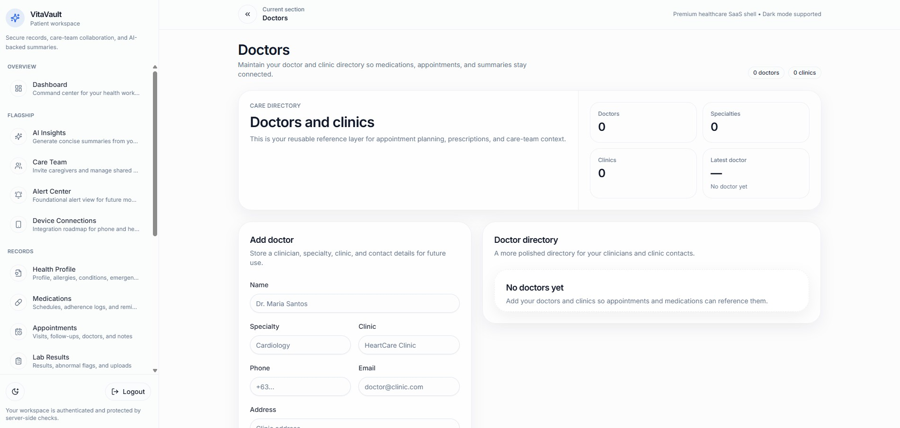 |

| Summary | Vitals |
|---|---|
| 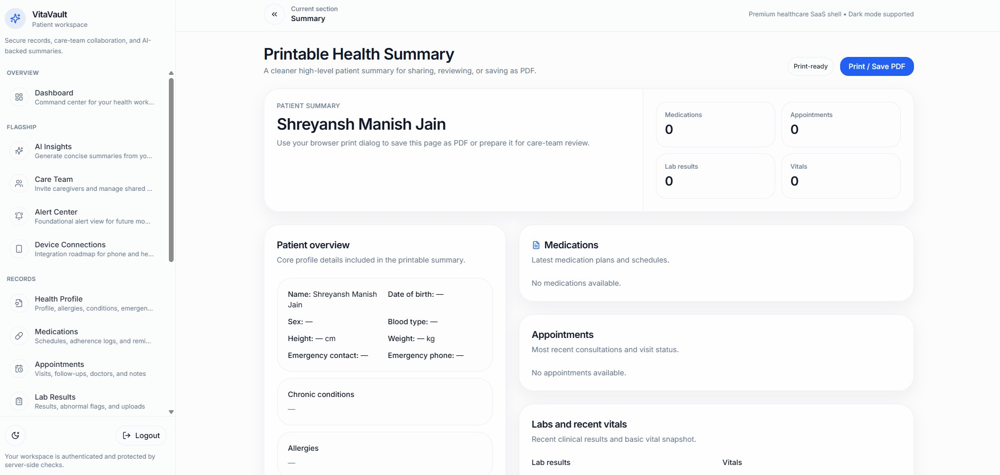 | 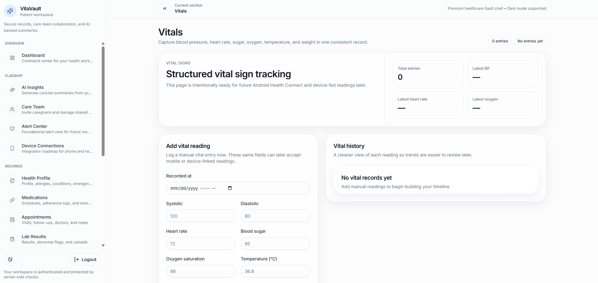 |

| Symptoms | Documents |
|---|---|
| 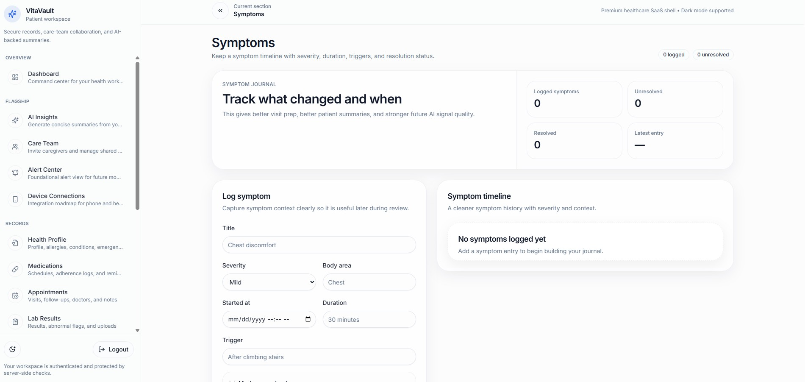 | 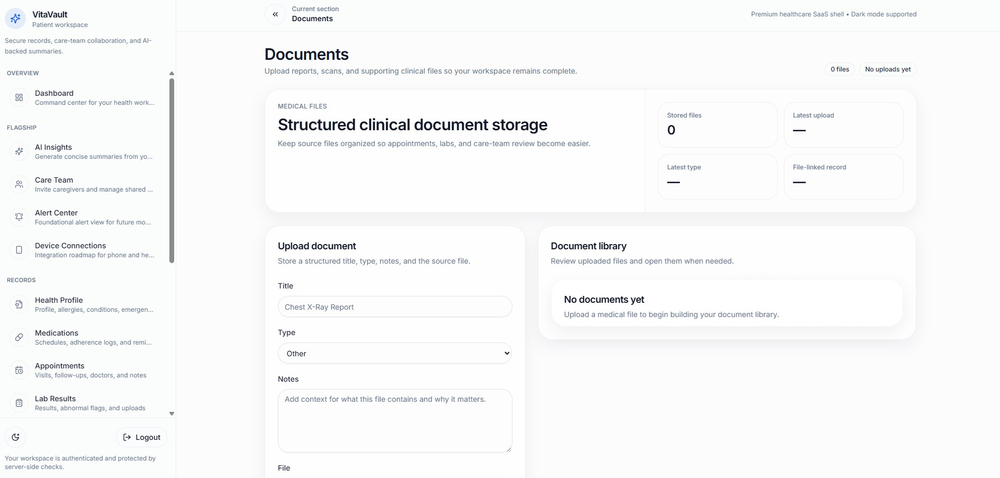 |

### Entry screens

| Landing Page | Login Page |
|---|---|
|  |  |

---

## Current product status

VitaVault is currently best described as a **feature-rich full-stack health platform foundation**.

Strongest areas:

- broad health record coverage
- Prisma domain modeling
- care-team and shared-access foundations
- alert, reminder, and notification workflows
- care planning, visit preparation, and review hubs
- background job architecture
- mobile/device API foundations
- demo and portfolio presentation surface
- admin, ops, security, audit, and test foundations

Main areas for future polish:

- sidebar grouping and navigation UX cleanup
- deeper AI insight source-linking
- export center v2 with more polished report packets
- production object storage abstraction for documents
- device sync simulator or import demo
- stronger demo parity pages for the newest authenticated hubs
- fuller test coverage around newly added feature hubs

See [`docs/KNOWN_LIMITATIONS.md`](docs/KNOWN_LIMITATIONS.md) for the honest current-state notes used to guide future patch planning.

---

## Roadmap direction

The next best upgrades are intentionally product-facing rather than random feature bloat:

1. **Navigation grouping / sidebar UX cleanup**
2. **Admin account lifecycle controls polish**
3. **AI Insights v2 with source-linked summaries**
4. **Export Center v2 and report packet polish**
5. **Device sync simulator / health data import demo**
6. **Production document storage abstraction**
7. **Expanded test coverage for the new review hubs**

That path turns the existing backend depth into a clearer, more impressive business-ready product experience.
